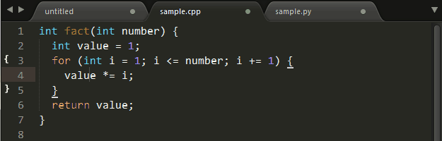
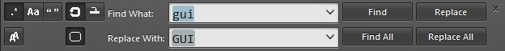
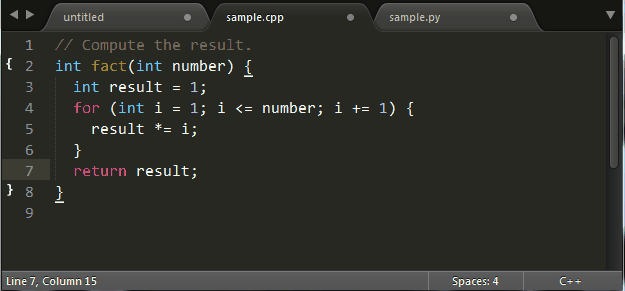
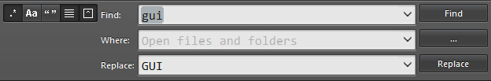

# Sublime Text查找&替换

由 425389019 创建，最后一次修改 2016-02-24 15:49:28

## 查找&替换（Finding&Replacing）

Sublime Text提供了强大的查找（和替换）功能，为了提供一个清晰的介绍，我将Sublime Text的查找功能分为快速查找、标准查找和多文件查找三种类型。

### 快速查找&替换

多数情况下，我们需要查找文中某个关键字出现的其它位置，这时并不需要重新将该关键字重新输入一遍然后搜索，我们只需要使用Shift + ←/→或Ctrl + D选中关键字，然后F3跳到其下一个出现位置，Shift + F3跳到其上一个出现位置，此外还可以用Alt + F3选中其出现的所有位置（之后可以进行多重编辑，也就是快速替换）。



### 标准查找&替换

另一种常见的使用场景是搜索某个已知但不在当前显示区域的关键字，这时可以使用Ctrl + F调出搜索框进行搜索：


以及使用Ctrl + H进行替换：



### 关键字查找&替换

对于普通用户来说，常规的关键字搜索就可以满足其需求：在搜索框输入关键字后Enter跳至关键字当前光标的下一个位置，Shift + Enter跳至上一个位置，Alt + Enter选中其出现的所有位置（同样的，接下来可以进行快速替换）。

Sublime Text的查找有不同的模式：Alt + C切换大小写敏感（Case-sensitive）模式，Alt + W切换整字匹配（Whole matching）模式，除此之外Sublime Text还支持在选中范围内搜索（Search in selection），这个功能没有对应的快捷键，但可以通过以下配置项自动开启。

```
"auto_find_in_selection": true
```

这样之后在选中文本的状态下范围内搜索就会自动开启，配合这个功能，局部重命名（Local Renaming）变的非常方便：



使用Ctrl + H进行标准替换，输入替换内容后，使用Ctrl + Shift + H替换当前关键字，Ctrl + Alt + Enter替换所有匹配关键字。

### 正则表达式查找&替换

正则表达式是非常强大的文本查找&替换工具，Sublime Text中使用Alt + R切换正则匹配模式的开启/关闭。Sublime Text的使用Boost里的Perl正则表达式风格。

出于篇幅原因，本文不会对正则表达式进行详细介绍，Mastering Regex（中译本：精通正则表达式）对正则表达式的原理和各语言下的使用进行了详细介绍。此外网上有大量正则表达式的优秀教程（“正则表达式30分钟入门教程”和MSDN正则表达式教程.aspx)），以及在线测试工具（regexpal和regexer）。

### 多文件搜索&替换

使用Ctrl + Shift + F开启多文件搜索&替换（注意此快捷键和搜狗输入法的简繁切换快捷键有冲突）：



多文件搜索&替换默认在当前打开的文件和文件夹进行搜索/替换，我们也可以指定文件/文件夹进行搜索/替换。