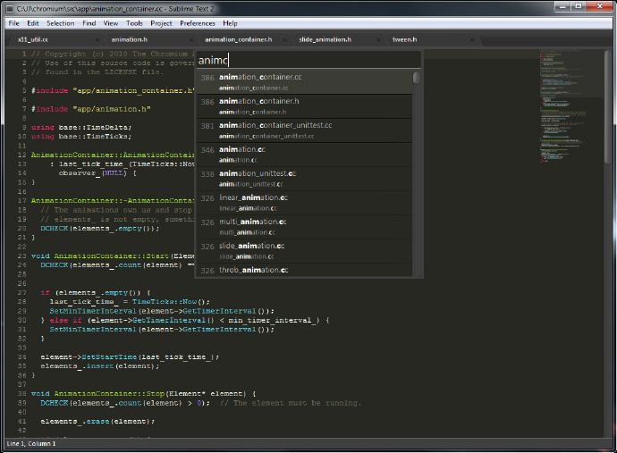

# Sublime Text风格

由 425389019 创建，最后一次修改 2016-02-24 15:49:23

## 风格（Styles）

风格对于任何软件都很重要，对编辑器也是如此，尤其是GUI环境下的编辑器。作为一个程序员，我希望我的编辑器足够简洁且足够个性。

Notepad++默认界面


Sublime Text默认界面



所以在用过Sublime Text之后，我立刻就卸掉了Notepad++。

Sublime Text自带的风格是我喜欢的深色风格（也可以调成浅色），默认主题是Monokai Bright，这两者的搭配已经很不错了，不过我们还可以做得更好：接下来我将会展示如何通过设置偏好项和添加自定义风格/主题使得Sublime Text更加Stylish。

### 一些设置（Miscellaneous Settings）

下面是我个人使用的设置项。

```
// 设置Sans-serif（无衬线）等宽字体，以便阅读
"font_face": "YaHei Consolas Hybrid",
"font_size": 12,
// 使光标闪动更加柔和
"caret_style": "phase",
// 高亮当前行
"highlight_line": true,
// 高亮有修改的标签
"highlight_modified_tabs": true,
```

设置之后的效果如下：


### 主题（Themes）

Sublime Text有大量第三方主题：[[https://sublime.wbond.net/browse/labels/theme\]，这里我给出几个个人感觉不错的主题](https://sublime.wbond.net/browse/labels/theme%5D%EF%BC%8C%E8%BF%99%E9%87%8C%E6%88%91%E7%BB%99%E5%87%BA%E5%87%A0%E4%B8%AA%E4%B8%AA%E4%BA%BA%E6%84%9F%E8%A7%89%E4%B8%8D%E9%94%99%E7%9A%84%E4%B8%BB%E9%A2%98)：

Soda Light


Soda Dark


Nexus


Flatland


Spacegray Light


Spacegray Dark


### 配色（Color）

colorsublime包含了大量Sublime Text配色方案，并支持在线预览，配色方案的安装教程在这里，恕不赘述。

我个人使用的是Nexus主题和Flatland Dark配色，配置如下：

```
"theme": "Nexus.sublime-theme",
"color_scheme": "Packages/Theme - Flatland/Flatland Dark.tmTheme",
```

效果如下：

