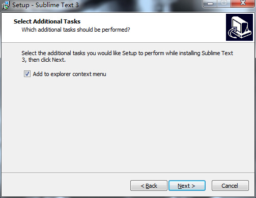
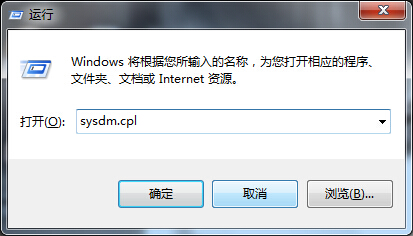
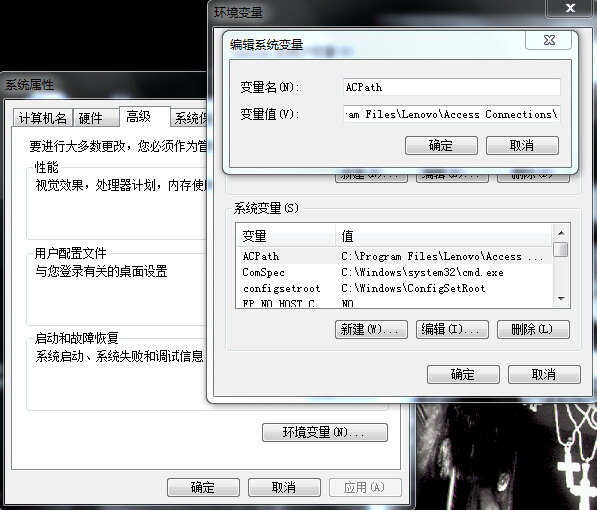
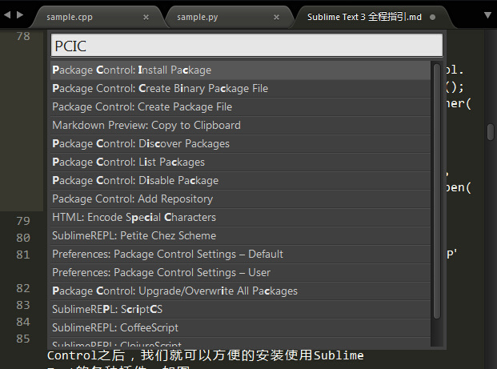
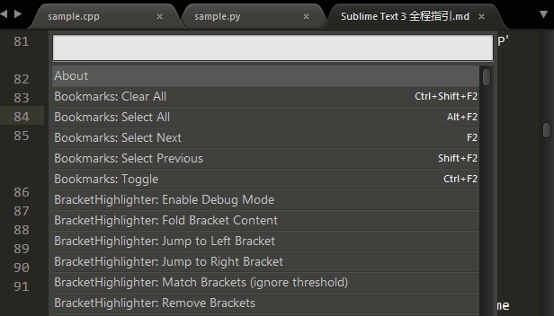

# Sublime Text安装

由 425389019 创建，最后一次修改 2016-02-24 15:49:24

## 安装（Installation）

[Sublime Text官方网](http://www.sublimetext.com/)站提供了Sublime Text各系统各版本的下载，目前Sublime Text的最新版本是Sublime Text 3。这里以Windows版本的Sublime Text安装为例。

注意在安装时勾选Add to explorer context menu，这样在右键单击文件时就可以直接使用Sublime Text打开。



### 添加Sublime Text到环境变量

使用Win + R运行sysdm.cpl打开“系统属性”。



然后在“高级”选项卡里选择“环境变量”，编辑“Path”，增加Sublime Text的安装目录（例如D:Program FilesSublime Text 3）。



接下来你就可以在命令行里面利用subl命令直接使用Sublime Text了：

```
subl file :: 使用Sublime Text打开file文件
subl folder :: 使用Sublime Text打开folder文件夹
subl . :: 使用Sublime Text当前文件夹
```

### 安装Package Control

前文提到Sublime Text支持大量插件，如何找到并管理这些插件就成了一个问题，Package Control正是为了解决这个问题而出现的，利用它我们可以很方便的浏览、安装和卸载Sublime Text中的插件。

进入Package Control的官网，里面有详细的安装教程。Package Control支持Sublime Text 2和3，本文只给出3的安装流程：

- 使用Ctrl + `打开Sublime Text控制台。
- 将下面的代码粘贴到控制台里：

```
import urllib.request,os,hashlib; h = '7183a2d3e96f11eeadd761d777e62404' + 'e330c659d4bb41d3bdf022e94cab3cd0'; pf = 'Package Control.sublime-package'; ipp = sublime.installed_packages_path(); urllib.request.install_opener( urllib.request.build_opener( urllib.request.ProxyHandler()) ); by = urllib.request.urlopen( 'http://sublime.wbond.net/' + pf.replace(' ', '%20')).read(); dh = hashlib.sha256(by).hexdigest(); print('Error validating download (got %s instead of %s), please try manual install' % (dh, h)) if dh != h else open(os.path.join( ipp, pf), 'wb' ).write(by)
```

- 等待Package Control安装完成。之后使用Ctrl + Shift + P打开命令板，输入PC应出现Package Control：



成功安装Package Control之后，我们就可以方便的安装使用Sublime Text的各种插件：

