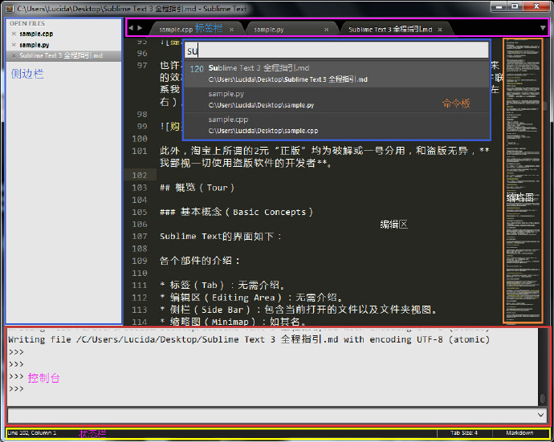

# Sublime Text概览

由 425389019 创建，425389019最后一次修改 2016-08-04 19:53:07

## 概览（Tour）

### 基本概念（Basic Concepts）

Sublime Text的界面如下：



- 标签（Tab）：无需介绍。
- 编辑区（Editing Area）：无需介绍。
- 侧栏（Side Bar）：包含当前打开的文件以及文件夹视图。
- 缩略图（Minimap）：如其名。
- 命令板（Command Palette）：Sublime Text的操作中心，它使得我们基本可以脱离鼠标和菜单栏进行操作。
- 控制台（Console）：使用Ctrl + `调出，它既是一个标准的Python REPL，也可以直接对Sublime Text进行配置。
- 状态栏（Status Bar）：显示当前行号、当前语言和Tab格式等信息。

### 配置（Settings）

与其他GUI环境下的编辑器不同，Sublime Text并没有一个专门的配置界面，与之相反，Sublime Text使用JSON配置文件，例如：

```
{
    "font_size": 12,
    "highlight_line": true,
}
```

会将默认字体大小调整为12，并高亮当前行。

JSON配置文件的引入简化了Sublime Text的界面，但也使得配置变的复杂，一般我会到这里查看可用的Sublime Text配置。