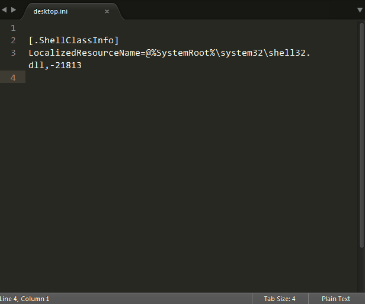
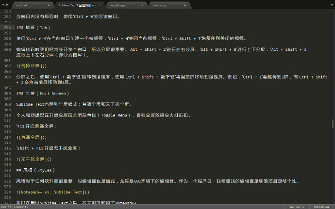
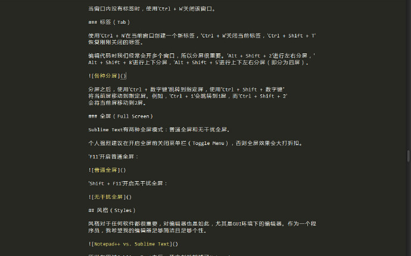

# Sublime Text窗口&标签

由 425389019 创建，最后一次修改 2016-02-24 15:49:31

## 窗口&标签（Windows & Tabs）

Sublime Text是一个多窗口多标签编辑器：我们既可以开多个Sublime Text窗口，也可以在一个Sublime Text窗口内开多个标签。

### 窗口（Window）

使用Ctrl + Shift + N创建一个新窗口（该快捷键再次和搜狗输入法快捷键冲突，个人建议禁用所有搜狗输入法快捷键）。

当窗口内没有标签时，使用Ctrl + W关闭该窗口。

### 标签（Tab）

使用Ctrl + N在当前窗口创建一个新标签，Ctrl + W关闭当前标签，Ctrl + Shift + T恢复刚刚关闭的标签。

编辑代码时我们经常会开多个窗口，所以分屏很重要。Alt + Shift + 2进行左右分屏，Alt + Shift + 8进行上下分屏，Alt + Shift + 5进行上下左右分屏（即分为四屏）。

分屏之后，使用Ctrl + 数字键跳转到指定屏，使用Ctrl + Shift + 数字键将当前屏移动到指定屏。例如，Ctrl + 1会跳转到1屏，而Ctrl + Shift + 2会将当前屏移动到2屏。

### 全屏（Full Screen）

Sublime Text有两种全屏模式：普通全屏和无干扰全屏。

个人强烈建议在开启全屏前关闭菜单栏（Toggle Menu），否则全屏效果会大打折扣。

F11切换普通全屏：

Shift + F11切换无干扰全屏：

