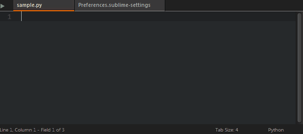
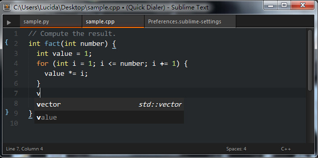
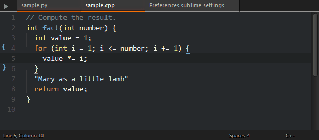
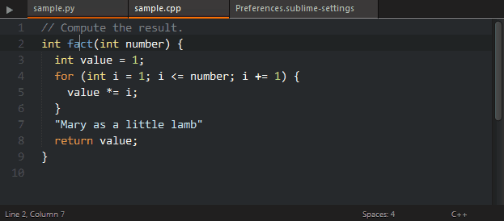
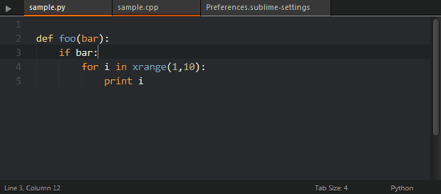

# Sublime Text编码

由 425389019 创建，最后一次修改 2016-02-24 15:49:24

## 编码（Coding）

优秀的编辑器使编码变的更加容易，所以Sublime Text提供了一系列功能以提高开发效率。

### 良好实践（Good Practices）

良好的代码应该是规范的，所以Google为每一门主流语言都设置了其代码规范（Code Style Guideline）。我自己通过下面的设置使以规范化自己的代码。

```Json
// 设置tab的大小为2
"tab_size": 2,
// 使用空格代替tab
"translate_tabs_to_spaces": true,
// 添加行宽标尺
"rulers": [80, 100],
// 显示空白字符
"draw_white_space": "all",
// 保存时自动去除行末空白
"trim_trailing_white_space_on_save": true,
// 保存时自动增加文件末尾换行
"ensure_newline_at_eof_on_save": true,
```

### 代码段（Code Snippets）

Sublime Text支持代码段（Code Snippet），输入代码段名称后Tab即可生成代码段。



你可以通过Package Control安装第三方代码段，也可以自己创建代码段，参考这里。

### 格式化（Formatting）

Sublime Text基本的手动格式化操作包括：Ctrl + [向左缩进，Ctrl + ]向右缩进，此外Ctrl + Shift + V可以以当前缩进粘贴代码（非常实用）。

除了手动格式化，我们也可以通过安装插件实现自动缩进和智能对齐：

- HTMLBeautify：格式化HTML。
- AutoPEP8：格式化Python代码。
- Alignment：进行智能对齐。

### 自动完成（Auto Completion）

Sublime Text 支持一定的自动完成，按Tab自动补全。



### 括号（Brackets）

编写代码时会碰到大量的括号，利用Ctrl + M可以快速的在起始括号和结尾括号间切换，Ctrl + Shift + M则可以快速选择括号间的内容，对于缩进型语言（例如Python）则可以使用Ctrl + Shift + J。



此外，我使用BracketHighlighter插件以高亮显示配对括号以及当前光标所在区域，效果如下：



### 命令行（Command Line）

尽管提供了Python控制台，但Sublime Text的控制台仅支持单行输入，十分不方便，所以我使用SublimeREPL以进行一些编码实验（Experiments）。



### 其它（Miscellaneous）

尽管我试图在本文包含尽可能多的Sublime Text实用技能，但受限于篇幅和我的个人经验，本文仍不免有所遗漏，欢迎在评论里指出本文的错误及遗漏。

下面是一些可能有用但我很少用到的功能：

- 宏（Macro）：Sublime Text支持录制宏，但我在实际工作中并未发现宏有多大用处。
- 其它平台（Other Platforms）：本文只介绍了Windows平台上Sublime Text的使用，不过Linux和OS X上Sublime Text的使用方式和Windows差别不大，只是在快捷键上有所差异，请参考Windows/Linux快捷键和OS X快捷键。
- 项目（Projects）：Sublime Text支持简单的项目管理，但我一般只用到文件夹。
- Vim模式（Vintage）：Sublime Text自带Vim模式。
- 构建（Build）：通过配置，Sublime Text可以进行源码构建。
- 调试（Debug）：通过安装插件，Sublime Text可以对代码进行调试。